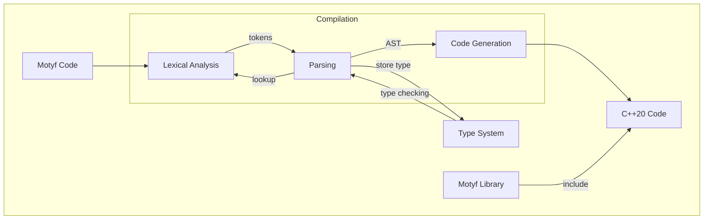

# `M0tyf` Programming Language

## Abstract
Software development is becoming as important as ever. With many new services and apps written and deployed, the need for a rich development platform with its ecosystem is highly demanded, and many have been provided and are popular among developers. The problem is that most of these tools come in the form of high level languages with very limited opportunities for performance optimization with low overhead abstraction costs. When the target is developer-friendliness, safety, flexibility, and performance, we are left with not much to choose from. Golang and Rust come with great innovative ideas, but there is still room for improvement. This paper will explain how Motyf tries to answer these challenges by adopting the best of features from many languages or even eliminating features outright.

## Background
In a world where CI/CD and DevOps are the norm, developer friendly platforms thrive. Vibrant community, cutting-edge features, rich libraries with package managers have become a must-have for a platform/programming language to become successful and widely adopted. While there are many platforms with interpreted languages such as Python with pip, Node.js with npm, Ruby with RubyGems, Perl with CPAN, and many more, it seems that high-performance languages have been left behind. There are Golang and Rust with Cargo, but there are still too many compromises compared to the daddy of performance languages C/C++.

Golang has been modelled too much to the creators’ liking; it has become a language that caters to specific needs. It is a good platform but still there are compromises. You will have to use their way of multi-processing since the coroutines and channels are embedded to the language. It is a library in the platform that you can opt to use, or rather use something else, it is part of the language so you have to use it.

Rust is very close, it is a powerful and capable high-performance language. But Rust introduces new concepts like ownerships and pointers which in some ways have the same complexity of understanding C++ smart pointers. So in this regard, Rust compromised by reintroducing complexity that it has tried to avoid to begin with.

Herb Sutter in his Cppcon 2022 presentations mentioned the possibility of eliminating pointer arithmetic altogether from a mock language of future C++[^1]. There is a possibility that we might eliminate certain features in a language so that we can prevent the use of unsafe code, even only partially, from the get go.

C/C++ is the top performer of all the languages as they have very low overhead in the produced binary. But it is ridden by death traps and pitfalls that will make inexperienced programmers facing horrifying crashes and drop of performance. The latter is quite ironic. It has been heard so many times that C++ has a poor performance where in reality the programmer has difficulties in understanding how to use C++ appropriately. In example, using `shared_ptr` wherever you see a pointer is one of the very real pitfalls. In an interview with Lex Fridman[^2] James Gosling mentions that Java was created because of pointer bugs in C++, but that doesn’t mean that you should use C++ just like you use Java. That is another pitfall that can lead to performance issues or even crashes.

It looks like C++ is very well misunderstood and getting a bad rap because of it. Or maybe it is because C++ runs on a committee that requires it to support backward compatibility because many companies supporting it need many kinds of legacy features. C++ is being held back by its own success. As the creator himself, Bjarne Stroustrup said: “Within C++, there is a much smaller and cleaner language struggling to get out.”[^3]

C/C++ also suffers from the lack of community driven online repository for common libraries where users can use package manager to use them. It is slowly inching towards package distribution by releasing support for modules in C++20. But it is still far away from the richness of package managers supported by other languages. Of course, this is by no means that we are saying that C++ needs it, not at all. But what we are saying is that we need a language that has the power of C++ with the richness of other languages’ package managers.

All of these challenges and future possibilities have been our driver in designing Motyf as the alternative of future high performance language. In fact, the talk given by Herb Sutter above, shows how he entertained the idea of designing the successor for C++ and how similar it was with our preliminary ideas for Motyf had pushed us to go ahead and design Motyf.

## Fundamental Concept
1. Motyf stands for modules, types and functions. Programming in Motyf basically designing structures in types, defining actions in functions and packaging all of them in modules.
2. Motyf should provides expressiveness for abstraction with low overhead introduced to the hardware requirements. This means that user   is enabled to write a high level abstraction which would generate code that is so efficient as if it was written closely to the hardware.
3. Motyf should be easy to use for any level of proficiency. It should be easy for new user to adopt quickly as if it is a high level    language, but also it discourage or prevent the writing of bad codes.
4. Motyf as a framework should be open for experienced user while at the same time promotes good code, i.e. advance memory efficient code as if an experienced user wrote it or prevents bad ones to avoid common errors and crashes.
5. Motyf should come with a full set of build tools, documentation and package manager which allow user to share modules in binaries or source code for easy code sharing, deployment and maintenance. 
6. Motyf should be compatible with system library which means it should be binary compatible with C libraries and operating systems library. Calling system calls should be a native capability in Motyf.
   
## Platform

### Toolchain
- Motyf is not a stand-alone direct to binary compiler. It generates a C++20 comply source and header files. 
- Motyf tools will test for C++ compiler and lets user to select prefered compiler.
- 

### Syntax

### Library

## Language Design

## Syntax Diagram

## The Compiler

### Lexical Analysis

### The Parser

## The Source Code

<pre>
 <code id="htmlViewer" style="color:rgb(220, 220, 220); font-weight:400;background-color:rgb(30, 30, 30);background:rgb(30, 30, 30);display:block;padding: .5em;"> 
module company.project.name
import motyf.core

/**
 * My class
 */
type my_class: {
    var size : int=0
    type my_allocator : allocator&lt;int&gt;

    var local_alloc : my_allocator 

    func do_something: (arg1: int) -&gt; int {
        
        if size == 0
            do_something()

        if size == 0; do_something()        

        if size == 0 {
            do_this()
            do_that()
        }

        return 0
    }    

    func do_multi: () -&gt; int, int {
        return 10, 0
    }

    // Functions without return types implies void return type
    func do_this() {

        // Subscript operator returns status and result
        var i, ok := my_array[0] 
    }

}</code></pre>
---

[^1]: https://www.youtube.com/watch?v=ELeZAKCN4tY&t=4759s
[^2]: https://www.youtube.com/watch?v=RrMptmNYkSw&t=115s
[^3]: Stroustrup, Bjarne. The Design and Evolution of C++. pp. 207.. A later clarification adds, "And no, that smaller and cleaner language is not Java or C#.". Bjarne Stroustrup's FAQ: Did you really say that?. Retrieved on 2007-11-15.

