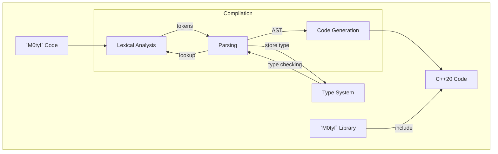

# `M0tyf` Programming Language

[](https://opensource.org/licenses/MIT)

`M0tyf` is an open source, experimental, programming language that aim to be user-friendly, safe, flexible and performant. 

- [Goals and motivation ](#goals-and-motivation)
- [Rationale](#rationale)
- [Fundamental Concept](#fundamental-concept)
- [Syntax](#syntax)
- [Transpiler Tools](#transpiler-tools)

## Goals and Motivation
Sometimes, at least in my case, it can be quite difficult to build a team of programmers with even levels of proficiency. Especially when we are going to use high performance language such as C/C++. A language where you have have to be really good at it to use it properly. Although you can write a very efficient and fast code, your team member might not be as good as you and produce bad codes that might slowdown or even crash your application. Thus, code reviews and teaching less experienced member is the norm, slowing down development and placing burden on your senior team members.

At first, I tried to solve this issue by creating a set of build tools and library for C++ to allow less experienced user to become more comfortable with C++. Easier to use build system, smart pointers, containers and others. As we progress with the development, it is increasingly obvious that we might not be able to reach our goals. A significant amount of understanding is still needed to use the library. So I moved to the next best thing by designing a language that is quite familiar for high level language users that will produce a safe C++ code and benefits from its strength.

The goal is to have a language that is familiar and easy to learn for intermediate users, safe to use, flexible for experienced users, produce efficient performant code and comes with rich tools and resources.   

## Rationale
In a world where CI/CD and DevOps are the norm, developer friendly platforms thrive. Vibrant community, cutting-edge features, rich libraries with package managers have become a must-have for a platform/programming language to become successful and widely adopted. While there are many platforms with interpreted languages such as Python with pip, Node.js with npm, Ruby with RubyGems, Perl with CPAN, and many more, it seems that high-performance languages have been left behind. There are Golang and Rust with Cargo, but there are still too many compromises compared to the daddy of performance languages C/C++.

Go is an excellent and widely used platform. It is simple, easy to use and has very rich community. Its virtue specifically in concurrent environment. But is is also where the problem is. You will have to use their way of multi-processing since the coroutines and channels are embedded to the language. It is not a library in the platform that you can opt to use, or rather use something else, it is part of the language so you have to use it. It is compromised because of the it solves specific problem only.

Rust is very close, it is a powerful and capable high-performance language. But Rust introduces new concepts like ownerships and pointers which in some ways have the same complexity of understanding C++ smart pointers. So in this regard, Rust compromised by reintroducing complexity that it has tried to avoid to begin with.

C/C++ is the top performer of all the languages as they have very low overhead in the produced binary. But it is ridden by death traps and pitfalls that will make inexperienced programmers facing horrifying crashes and drop of performance. The latter is quite ironic. It has been heard so many times that C++ has a poor performance where in reality the programmer has difficulties in understanding how to use C++ appropriately. In example, using `shared_ptr` wherever you see a pointer is one of the very real pitfalls. In an interview with Lex Fridman[^1] James Gosling mentions that Java was created because of pointer bugs in C++, but that doesn’t mean that you should use C++ just like you use Java. That is another pitfall that can lead into performance issues or even crashes. Herb Sutter in his Cppcon 2022 presentations mentioned the possibility of eliminating pointer arithmetic altogether from an experiment language of future C++ (cpp syntax 2)[^2]. There is a possibility that we might eliminate certain features in a language so that we can prevent the use of unsafe code, even only partially, from the get go.

It looks like C++ is very well misunderstood and getting a bad rap because of it. Or maybe it is because C++ runs on a committee that requires it to support backward compatibility because many companies supporting it need many kinds of legacy features. C++ is being held back by its own success. As the creator himself, Bjarne Stroustrup said: “Within C++, there is a much smaller and cleaner language struggling to get out.”[^3]

C/C++ also suffers from the lack of community driven online repository for common libraries where users can use package manager to use them. It is slowly inching towards package distribution by releasing support for modules in C++20. But it is still far away from the richness of package managers supported by other languages. Of course, this is by no means that we are saying that C++ needs it, not at all. But what we are saying is that we need a language that has the power of C++ with the richness of other languages’ package managers.

All of these challenges and future possibilities have been our driver in designing `M0tyf` as the alternative of future high performance language. In fact, the talk given by Herb Sutter above, shows how he entertained the idea of designing the successor for C++ and how similar it was with our preliminary ideas for `M0tyf` had pushed us to go ahead and design `M0tyf`.

## Fundamental Concept
1. `M0tyf` stands for modules, types and functions. Programming in `M0tyf` basically designing structures in types, defining actions in functions and packaging all of them in modules.
2. `M0tyf` should provides expressiveness for abstraction with low overhead introduced to the hardware requirements. This means that user   is enabled to write a high level abstraction which would generate code that is so efficient as if it was written closely to the hardware.
3. `M0tyf` should be easy to use for any level of proficiency. It should be easy for new user to adopt quickly as if it is a high level    language, but also it discourage or prevent the writing of bad codes.
4. `M0tyf` as a framework should be open for experienced user while at the same time promotes good code, i.e. advance memory efficient code as if an experienced user wrote it or prevents bad ones to avoid common errors and crashes.
5. `M0tyf` should come with a full set of build tools, documentation and package manager which allow user to share modules in binaries or source code for easy code sharing, deployment and maintenance. 
6. `M0tyf` should be compatible with system library which means it should be binary compatible with C libraries and operating systems library. Calling system calls should be a native capability in `M0tyf`.

## Syntax
1. All `M0tyf` source files is started with module declaration depicting which module this file belong to.
```javascript
module company.project.module
```

2. Import declarations come after module declaration.
```javascript
import std.vector from <vector>
import std.cout from <iostream>
import motyf.fmt
``` 

3. Comments can use multi-line and single-line format.
```javascript
/**
 * THE SOFTWARE IS PROVIDED "AS IS", WITHOUT WARRANTY OF ANY KIND, EXPRESS OR
 * IMPLIED, INCLUDING BUT NOT LIMITED TO THE WARRANTIES OF MERCHANTABILITY,
 * FITNESS FOR A PARTICULAR PURPOSE AND NONINFRINGEMENT. IN NO EVENT SHALL THE
 * AUTHORS OR COPYRIGHT HOLDERS BE LIABLE FOR ANY CLAIM, DAMAGES OR OTHER
 * LIABILITY, WHETHER IN AN ACTION OF CONTRACT, TORT OR OTHERWISE, ARISING FROM,
 * OUT OF OR IN CONNECTION WITH THE SOFTWARE OR THE USE OR OTHER DEALINGS IN THE
 * SOFTWARE.
 */
module company.project.module

import std.vector from <vector>     // This is import from C++ header file
import std.cout from <iostream>     // this is import form C++ header file
import motyf.fmt                    // This is import from M0tyf module
```

4. A module file can contains one or more type declaration. A type declaration can be a new type declaration or an alias declaration.

```go
type flags : uint32

type strings : vector<string>

type point : {
    var x : int32
    var y : int32
}

type node<T> : {
    var data : T
}
```

5. Function declarations are allowed within module or a type.
```go
type point : {
    var x : int32
    var y : int32 
}
```

## Transpiler Tools
`M0tyf` is not a stand-alone direct to binary compiler. It generates a C++20 compliant source and header files. `M0tyf` tools will test for C++ compiler and lets user to select prefered compiler.


1. `M0tyf` will install its binaries in `/usr/share` for its global file storage and `~/motyf` as its local file storage.
2. Global file storage stores `M0tyf` binaries and global modules. It is defined in environment variable called MOTYF_GLOBAL.
3. Local file storage stores local modules and projects. It is defined in environment variable called MOTYF_HOME
4. The path might look something like this 
    - `/usr/shared/motyf/bin`
    - `/usr/shared/motyf/mod`
    - `/home/bob/motyf/mod`
    - `/home/bob/motyf/prj`
5. Packages stored in its folder following its modules name, i.e:
    - Files for module `mycompany.myproject.mymodule` is stored globally under `/usr/shared/motyf/mod/mycompany/myproject/mymodule/`
    - Files for module `mycompany.myproject.mymodule` is stored locally under `/home/bob/motyf/mod/mycompany/myproject/mymodule/`
6. The global path can be altered by exporting variable MOTYF_GLOBAL
7. The local path can be altered by exporting variable MOTYF_LOCAL
8. Changing global path can be useful for switching between different versions of `M0tyf`.
9. Changing local path can be useful for switching between workspaces.
10. Once binary is built, the path no longer makes any different since everything will be statically linked.
11. Temporary builds stored under
    - `/home/bob/motyf/temp/mycompany/myproject/mymodule`
12. Executable binaries form builds will be produced in the project directory.
13. Files with `main()` will be compiled as runnable binary. The name of the binary will be the same with the source file name without
    the extention.
14. Files without main will be considered as a module definition and should declare which module it is belong to by declaring 
    it in the beginning of the source file, i.e.: `module mycompany.myproject.mymodule`
15. Modules will produce definition file, C/C++ header file and static library file '.a'. For example `mymodule.mtf` will produce
    `mymodule.mdf`, `mymodule.h` and `mymodule.a`.
16. Once deployed, those files will be put under the global or local storage as explained above.

    For example, lets say we have a project under `/home/bob/motyf/prj/web_service/`. We have 3 files in the project:
    1. main.mtf
    2. server.mtf
    3. handler.mtf

    In `main.mtf` we implemented our `main()`. In `server.mtf` we implemented the web server and declared the it under the module
    `module bob.web_service`. In `handler.mtf` we implemented the services and delcared in under the module `module bob.web_service`.

    If we run `mc build web_service` and all the code compile correctly, we will get the following files under 
    `/home/bob/motyf/temp/bob/web_service/`:
    1. `main`, executable
    2. `server.mdf`, module definition file
    3. `server.h`, C++ header file
    4. `server.a`, static library file
    5. `handler.mdf`, module definition file
    6. `handler.h`, C++ header file
    7. `handler.a`, static library file

    The compiler will use the mdf files for type checking. It is used when a file import a module i.e. `import bob.web_service.Server`. 
    
    It will look for mdf file under the following path consecutively:
    1. `$MOTYF_HOME/temp/mod/`
    2. `$MOTYF_HOME/mod/`
    3. `$MOTYF_GOBAL/mod/`
    
    When you run `mc package web_service`, it will install all the module related files under `$MOTYF_HOME/mod/web_service`.

    When you run `mc deploy web_service`, it will install all the module related files under `MOTYF_GLOBAL/mod/web_service`.

    When you run `mc clean web_service`, it will delete all temp files under `$MOTYF_HOME/temp/mod/web_service`.
